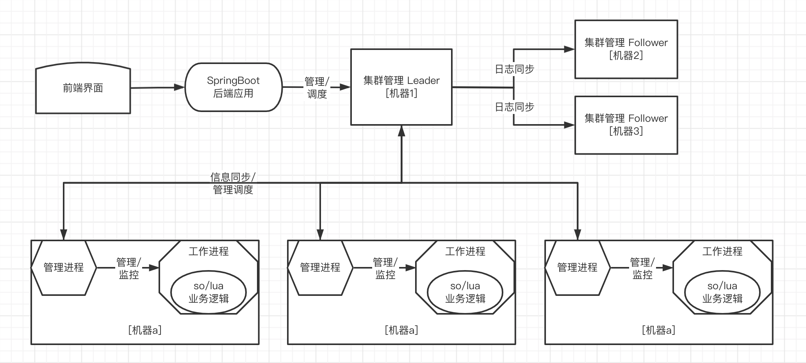

# Portal

基于Raft 分布式共识算法设计

使用C、C++、Lua 实现的分布式管理框架

## 相关技术栈和参考

* Raft 日志条目和日志快照涉及文件IO，参考
    * [https://github.com/xumenger/cDBF](https://github.com/xumenger/cDBF)
    * [深入理解DBF文件格式](http://www.xumenger.com/dbf-20160703/)
* 使用Protobuf 作为通讯协议和序列化工具
    * [序列化协议Protobuf](http://www.xumenger.com/protobuf-20190525/)
* 基于epoll 独立实现一个事件驱动的网络库
* 基于堆数据结构实现一个定时器组件
* 支持.so 的扩展方式
* 支持lua 的扩展方式

## 架构设计

>绘图工具：[https://www.processon.com/diagrams](https://www.processon.com/diagrams)

分为四层

1. 基于Raft 实现的管理调度集群
2. 工作机器上的管理进程
3. 工作机器上的工作进程
4. 工作进程内基于so/lua 实现的业务逻辑

