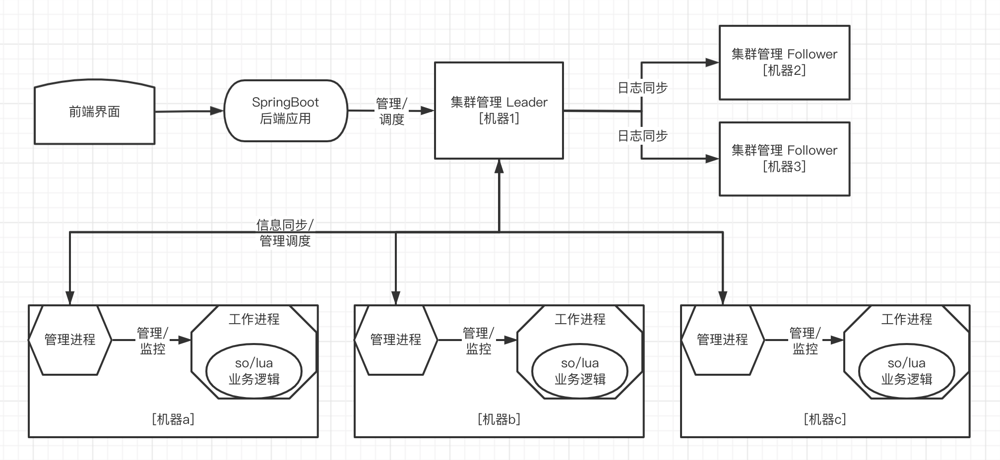

## Portal说明

基于Raft 分布式共识算法设计

使用C、C++、Lua 实现的分布式管理框架


## 架构设计

>绘图工具：[https://www.processon.com/diagrams](https://www.processon.com/diagrams)



整个框架分为四层

1. 基于Raft 实现的管理调度集群
2. 工作机器上的管理进程
3. 工作机器上的工作进程
4. 工作进程内基于so/lua 实现的业务逻辑


## 编译部署

**编译Java proto**

```shell

```

**编译C++ proto**

```shell
cd ./src/proto/
protoc -I=./ --cpp\_out=../raft/ ./raftProto.proto
```


## 全量相关文档

**client**

>以此工程推动研究Java、JVM、Java并发编程、Spring、HTTP、Servlet、Tomcat、MySQL、InnoDB、PostgreSQL、DDD、TDD、

* [20240204 - SpringBoot 开发环境搭建]()
* [2024???? - SpringBoot 使用Protobuf]()
* [2024???? - 客户端应用接口定义]()
* [2024???? - 搭建MySQL 环境]()
* [2024???? - 客户端应用对接MySQL]()
* [2024???? - InnoDB 索引分裂复现与分析]()
* [2024???? - 搭建PostgreSQL 环境]()
* [2024???? - 客户端应用对接PostgreSQL]()
* [2024???? - JDBC 协议解析]()
* [2024???? - JdbcTemplate 深入分析]()

**portal**

>以此工程推动研究C++、etcd、Raft、TCP/IP、网络编程、select、poll、epoll、

* [20240205 - 运行起来Portal Mock]()
* [2024???? - Portal Raft 协议Protobuf 接口说明]()
* [2024???? - Portal BIO 模式支持Raft]()
* [2024???? - Linux select]()
* [2024???? - Linux poll]()
* [2024???? - Linux epoll]()
* [2024???? - NIO 网络库封装]()
* [2024???? - Portal NIO 模式支持Raft]()

**agent**

>以此工程推动研究C++、Lua、so、Linux、多进程、多线程、

* [20240206 - Agent fork 多进程]()
* [2024???? - Agent fork 进程支持多线程]()
* [2024???? - Agent fork 进程支持so 扩展]()
* [2024???? - Agent fork 进程支持lua 扩展]()

**worker**

>以此工程推动研究C++、Linux、namespace、cgroup、Docker、

* [2024???? - Linux namespace 深究]()
* [2024???? - Linux cgroup 深究]()


## 开发日志

>2022.02.19

1. 定义Raft 算法的关键数据结构
2. 定义Protobuf 接口

>2023.12.14

1. 项目的目录结构如何划分
2. 项目的模块如何划分？
3. 怎么能够方便调试？
4. 可以应用什么设计模式？
5. 怎么做单元测试？

